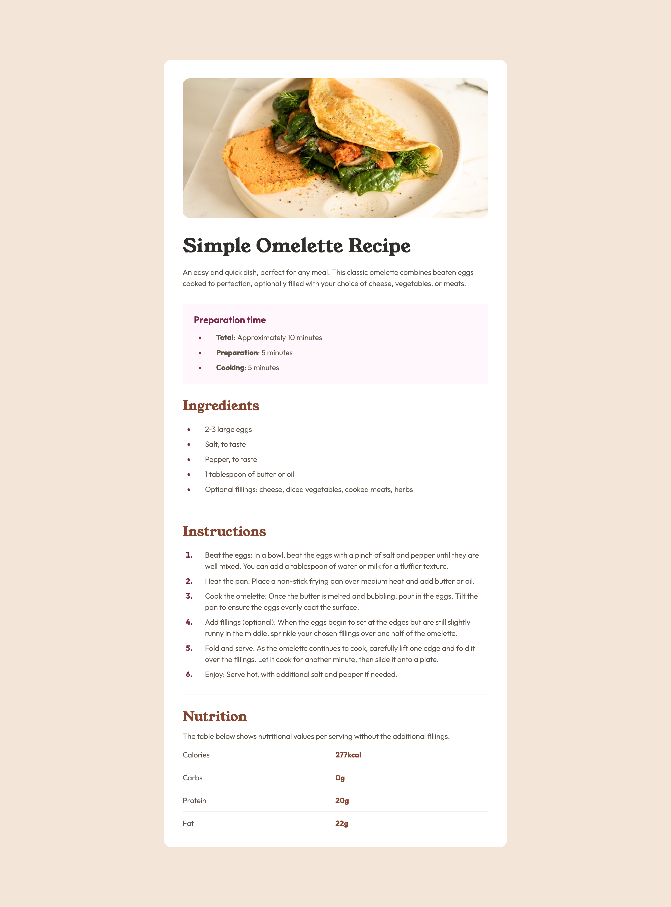
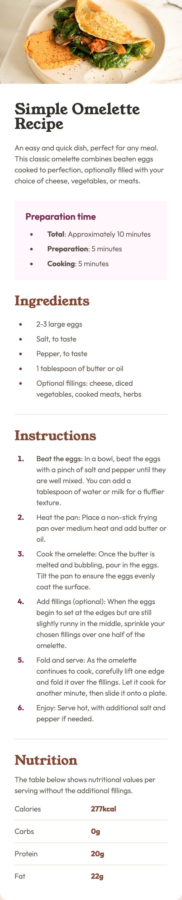

# Frontend Mentor - Recipe page solution

This is a solution to the [Recipe page challenge on Frontend Mentor](https://www.frontendmentor.io/challenges/recipe-page-KiTsR8QQKm). Frontend Mentor challenges help you improve your coding skills by building realistic projects.

## Table of contents

- [Overview](#overview)
  - [Screenshot](#screenshot)
  - [Links](#links)
- [My process](#my-process)
  - [Built with](#built-with)
  - [Useful resources](#useful-resources)
- [Author](#author)
- [Acknowledgments](#acknowledgments)

## Overview

### Screenshot

### Links

- Solution URL: [Solution URL](https://github.com/harkhanid/MortgageCalulator)
- Live Site URL: [live site URL](https://harkhanid.github.io/RecipePage/)

## My process

### Built with

- Semantic HTML5 markup
- CSS custom properties
- Mobile-first workflow

### Useful resources

- [ChatGPT](https://chatgpt.com/) - This helped me alot trobleshooting minor issues.

## Author

- Website - [Harkhani Dharmik](https://harkhanidharmik.com/)
- Frontend Mentor - [@harkhanid](https://www.frontendmentor.io/profile/yourusername)
